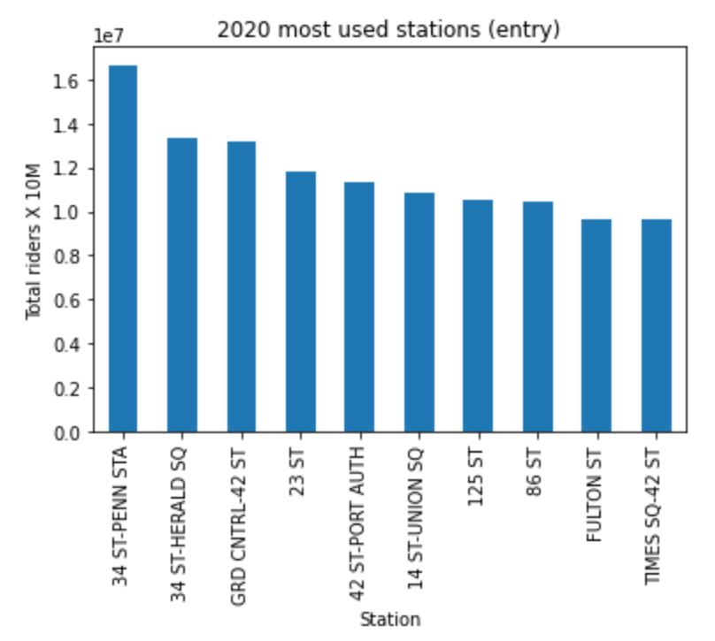

# MVP  
The aim of the project is to detrmint the crowded stations in Riyadh based on data from the MTA.  

  
  
The geolocation features (e.g.: work place, housing area, school zone, etc... .) of these stations will be extracted then mapped to Riyadh's metro station,  
to identify top 10 crowded stations so they can be prioritized in future plans.
